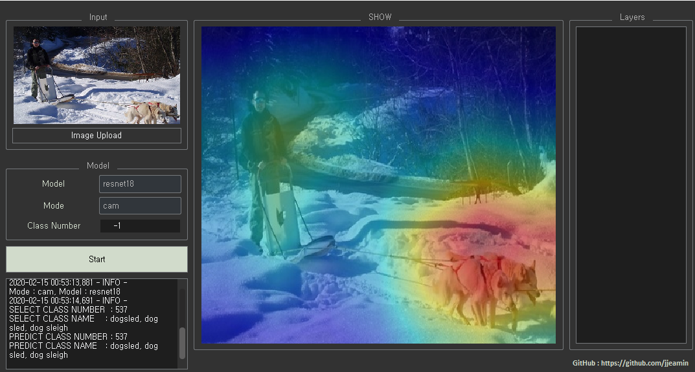
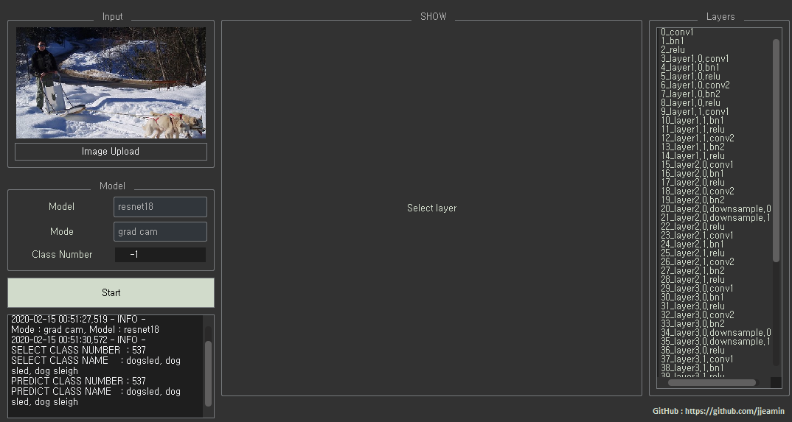

# Visual_QTorch

Deep Learning Visualization Tools Using PyTorch

## Requirement 
- [Pytorch 1.1.0](https://pytorch.org/get-started/locally/)
- PyQt5

```shell script
pip install PyQt5
```

## Demo

- CAM



- Grad CAM



## How to use

```shell script
python view.py
```

1. Upload Image
2. Select Model
3. Select Mode
4. Select Class Number(model predict : -1)
5. Click Start

## Support Dataset

- ImageNet

## Support Model

- Resnet18

## Support Vis

- [CAM](https://arxiv.org/abs/1512.04150)
- [Grad CAM](https://arxiv.org/abs/1610.02391)
- [Guided Backprop](https://arxiv.org/abs/1610.02391)
- Vanilla Grad
- [Smooth Grad](https://arxiv.org/abs/1706.03825) (Slow..)

## TODO

- [ ] Smooth Grad Update
- [ ] Class Number View Update
- [ ] ADD Support Model
- [ ] ADD Support Visualization
- [ ] ADD Support Dataset
- [ ] ...

## Reference:
- [https://gist.github.com/yrevar/942d3a0ac09ec9e5eb3a](https://gist.github.com/yrevar/942d3a0ac09ec9e5eb3a)
- [https://github.com/utkuozbulak/pytorch-cnn-visualizations](https://github.com/utkuozbulak/pytorch-cnn-visualizations)
